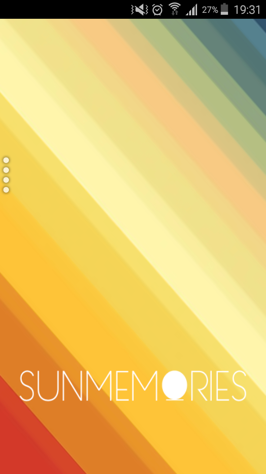
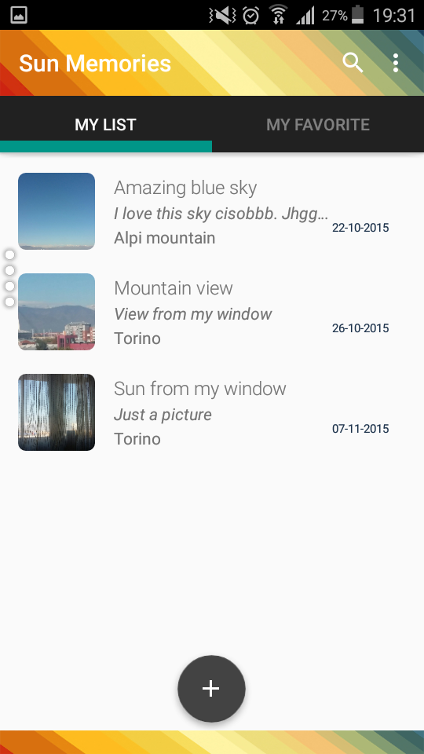
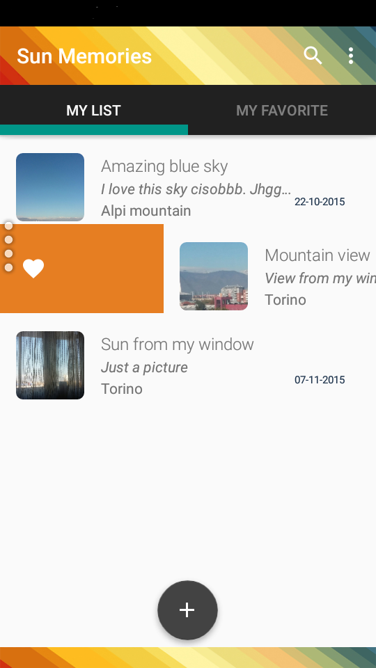
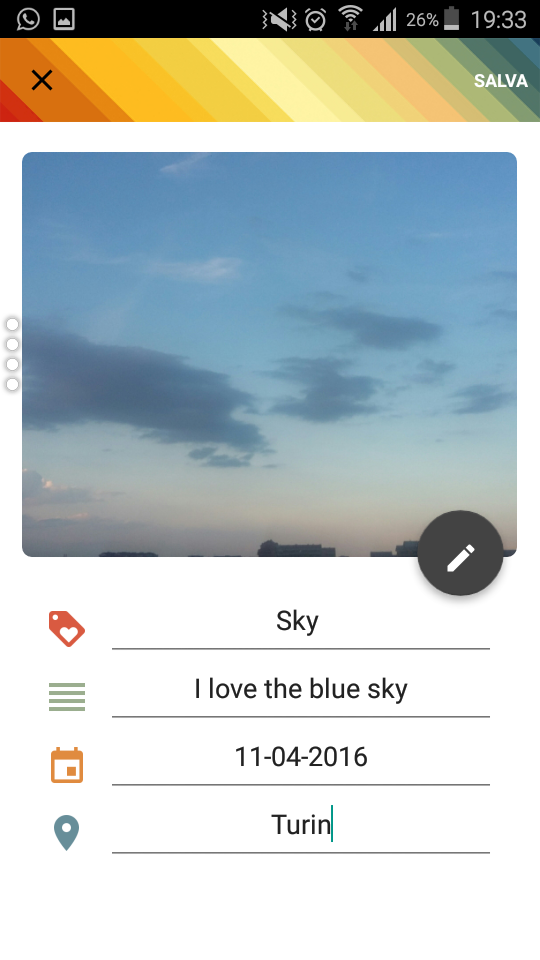
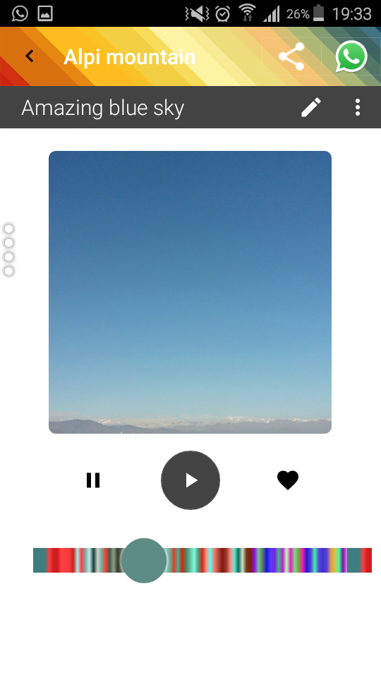

# SunMemories

SunMemorie is an Android application that communicate with a LED Lamp via Bluetooth 4.0 (GATT protocol)

ACTIVITIES
===================
  *SPLASH 

 
 
  *HOME
 
  

  Use a RecyclerView with a SwipeToAction adapter for each item

  
  
  *NEW ELEMENT
  
  
    
  *VIEW ELEMENT
  
  
